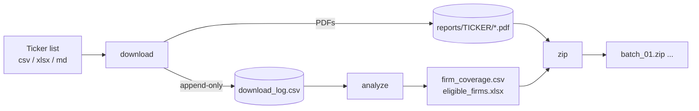

# Vietstock Governance Reports Downloader

[](https://github.com/YOUR-USERNAME/vietstock-governance-reports/actions/workflows/tests.yml)


Resumable, rate-limited bulk downloader for annual **corporate governance reports (BCTHQT – *Báo cáo tình hình quản trị công ty*)** of Vietnamese listed firms, plus a coverage analysis that selects firms with enough consecutive years of data for research.

Built to assemble a document corpus for a thesis on Vietnamese listed companies (HOSE / HNX / UPCoM, 2020–2025).

## What it does



1. **`download`** – fetches one report per firm per year, trying the firm's listed exchange first and falling back to the others (firms switch exchanges).
2. **`analyze`** – counts available years and consecutive-year pairs per firm and exports the firms that meet your threshold.
3. **`zip`** – packs reports into batches (optionally only eligible firms).

## Quick start (3 steps)

**1. Get the code**

```bash
git clone https://github.com/YOUR-USERNAME/vietstock-governance-reports.git
cd vietstock-governance-reports
pip install -e .
```

**2. Put your ticker list in `input/`**

Replace [`input/tickers.csv`](input/tickers.csv) with your own `.csv` or `.xlsx` file (or pass any path with `--tickers`). Only the **Ticker** column is required:

| Ticker | Exchange | Industry |
|---|---|---|
| VNM | HOSE | Food & Beverage |
| PVS | HNX | Oil & Gas |

`Exchange` (HOSE / HNX / UPCOM) and `Industry` are optional; if `Exchange` is blank or wrong, all three exchanges are tried.

**3. Run**

```bash
govreports download                 # reads input/tickers.csv, writes to output/
govreports analyze                  # which firms have enough consecutive years?
govreports zip --eligible-only      # optional: pack PDFs into ZIP batches
```

Customize when needed, e.g. `govreports download --tickers my_firms.xlsx --years 2018-2024 --out my_output`.

> Tip: try ~10 tickers first. Large runs can be stopped (`Ctrl+C`) and resumed by re-running the same command.

### No installation? Use Google Colab

[](https://colab.research.google.com/github/YOUR-USERNAME/vietstock-governance-reports/blob/main/notebooks/colab_quickstart.ipynb)

Run the notebook top to bottom: it has an **upload button** for your CSV/Excel file and can save results to Google Drive.

## Output layout

```
output/
├── reports/AAA/AAA_2020_BCTHQT.pdf ...
├── download_log.csv        # one row per attempt: status, exchange found, URLs tried, timestamp
├── firm_coverage.csv       # years available / missing / consecutive pairs per firm
├── eligible_firms.xlsx     # firms meeting --min-pairs
└── zip_batches/batch_01.zip ...
```

## Options worth knowing

| Flag | Default | Meaning |
|---|---|---|
| `--workers` | 8 | parallel workers (one ticker per worker) |
| `--rate` | 5 | max requests/second **across all workers** |
| `--retries` | 3 | retries on 429 / 5xx / network errors (exponential backoff, honours `Retry-After`) |
| `--retry-missing` | off | re-check reports previously recorded as `not_found` (e.g. a 2025 report published later) |
| `--min-pairs` | 3 | consecutive-year pairs a firm needs to be eligible |

Re-running the same command is always safe: finished reports and confirmed-missing ones are skipped, transient errors are retried.

## Design decisions

- **Concurrency without hammering the server.** A thread pool speeds things up, while a shared rate limiter keeps total requests/second bounded regardless of worker count.
- **Fewer wasted requests.** Once a report is found on an exchange, that exchange is tried first for the firm's remaining years.
- **Correct "missing" vs "failed".** A 404 or an HTML page served with HTTP 200 means *not found*; timeouts, 429s and 5xx mean *error* and are retried on the next run. A flaky connection never silently shrinks the dataset.
- **No corrupt files.** Downloads stream to `.part`, are verified (`%PDF` header, `Content-Length`), then atomically renamed.
- **O(1) checkpointing.** The log is append-only; the original approach of rewriting the whole CSV after every report is O(n²).
- **Safe by construction.** Tickers are validated before they reach a URL or file path.
- **Tested offline.** The test suite spins up a local fake server covering fallback, soft-404s, 503s, truncated bodies and resume behaviour – no internet required.

```bash
pytest -q          # or: python -m unittest discover -s tests
```

## Responsible use

This tool requests publicly accessible files from `static2.vietstock.vn`. It is not affiliated with Vietstock. Check the site's terms of use and `robots.txt` before large crawls, keep the default rate limit (or lower it), and don't redistribute the downloaded reports. Intended for academic and personal research.

## License

MIT – see [LICENSE](LICENSE).
